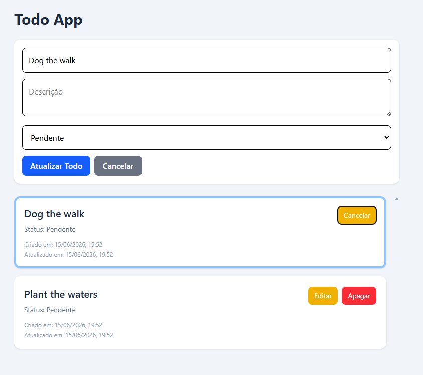

# Demo

Aplicação web desenvolvida com Spring Boot, React, Vite e PostgreSQL.

## Estrutura do Projeto

O frontend foi desenvolvido com React + Vite e está localizado em:

```text
src/main/webapp
```

Os arquivos estáticos gerados pelo build do frontend são copiados para:

```text
src/main/resources/static
```

e são servidos automaticamente pelo Spring Boot.

## Requisitos

### Node.js

```bash
node -v
```

Versão utilizada:

```text
v24.14.0
```

### NPM

```bash
npm -v
```

Versão utilizada:

```text
11.12.1
```

### Java

```bash
java -version
```

Versão utilizada:

```text
java version "21.0.10" 2026-01-20 LTS
Java(TM) SE Runtime Environment (build 21.0.10+8-LTS-217)
Java HotSpot(TM) 64-Bit Server VM (build 21.0.10+8-LTS-217, mixed mode, sharing)
```

> Observação: utilize `java -version`. O comando `java -v` não é suportado.

## Iniciando os Serviços

Suba os serviços necessários (PostgreSQL, etc.):

```bash
docker compose -f docker/services.yml up -d
```

## Executando a Aplicação

Inicie a aplicação Spring Boot:

```bash
./mvnw spring-boot:run
```

A aplicação ficará disponível em:

```text
http://localhost:8080
```

## Executando Apenas o Frontend

Entre na pasta do frontend:

```bash
cd src/main/webapp
```

Instale as dependências:

```bash
npm install
```

Inicie o servidor de desenvolvimento:

```bash
npm run dev
```

O frontend ficará disponível em:

```text
http://localhost:5173
```

As requisições para `/api` serão encaminhadas para o backend através da configuração de proxy do Vite.

## Gerando Apenas o Build do Frontend

```bash
cd src/main/webapp
npm run build
```

Os arquivos gerados serão copiados para:

```text
src/main/resources/static
```

## Build Completo da Aplicação

Para gerar o build completo (frontend + backend):

```bash
./mvnw clean package
```

Durante o build:

* O frontend é compilado automaticamente pelo Maven.
* Os arquivos estáticos do frontend são copiados para `src/main/resources/static`.
* Os testes do backend são executados automaticamente.

> Os testes do frontend devem ser executados separadamente através do comando `npm run test`.

## Build Sem Testes do Backend

```bash
./mvnw clean package -DskipTests
```

## Executando os Testes do Backend

Execute todos os testes do backend:

```bash
./mvnw test
```

Para executar uma classe de teste específica:

```bash
./mvnw test -Dtest=TodoServiceTest
```

Os testes do backend utilizam:

* JUnit 5
* Mockito
* Spring Boot Test
* H2 Database (ambiente de testes)

### Cobertura Atual

Os testes cobrem os principais fluxos da aplicação:

* Criação de tarefas
* Consulta de tarefas
* Consulta por ID
* Atualização de tarefas
* Atualização parcial de tarefas
* Exclusão de tarefas
* Tratamento de erros para registros inexistentes

## Executando os Testes do Frontend

Entre na pasta do frontend:

```bash
cd src/main/webapp
```

Execute os testes:

```bash
npm run test
```

Para executar os testes em modo watch:

```bash
npm run test -- --watch
```

Os testes do frontend utilizam:

* Vitest
* React Testing Library
* Jest DOM
* User Event

### Cobertura Atual

Os testes cobrem os principais fluxos da aplicação:

* Carregamento da lista de tarefas
* Criação de tarefas
* Edição de tarefas
* Cancelamento de edição
* Atualização de tarefas
* Exclusão de tarefas

## Screenshot

<p align="center">
  
</p>